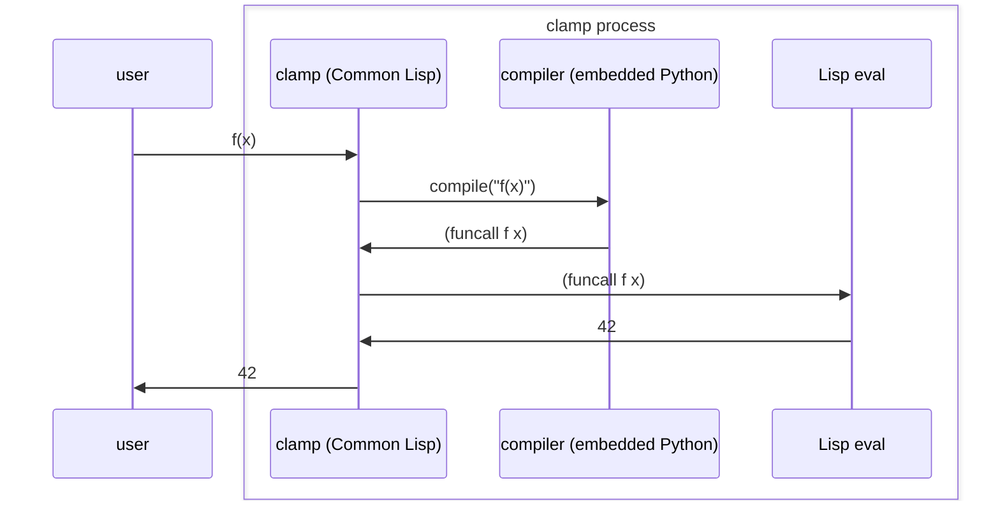

clamp
=====

TL;DR
-----

`./clamp_driver.py some_file.py` : Compile `some_file.py` from Python 3 to Common Lisp and print out the resulting code.

`make clean; make` : Ye olde Makefile based build :-P

`./clamp` : Interactive mode (kinda wonky at the moment)

`./clamp some_file.py` : Run `some_file.py`.



Parsing Python
--------------

Use the built-in Python AST parsing module. Invoke Python from Common Lisp (SBCL) using C API bindings.

From https://www.linuxjournal.com/article/8497

Docs are here: https://docs.python.org/3/library/ast.html

Run `python-config` for compile/link flags if needed.

```
Py_Initialize();
PyRun_SimpleString(code);
Py_Finalize();
```

Implement in Python the translation to Common Lisp, have the Lisp system eval the result of the Python translation code.

SBCL Foreign Function Interface:
http://www.sbcl.org/manual/index.html#Foreign-Function-Interface

Lisp-1 versus Lisp-2
--------------------

Just treat Python functions as normal variables and always use #'apply or #'funcall to invoke them in the generated Lisp code.

Packages versus Modules
-----------------------

Need to explore the semantic differences.

Lisp packages are just scoping containers for symbols. A symbol can be interned in multiple packages, and packages can have aliases (nicknames).

Two approaches to consider:

1. Because Lisp package names are any string, they should support full Python module names like "a.b.c" as a package name. Need to see if "from m import f" can map correctly.
2. Use thread-safe hashtables to models packages and traverse them to look up qualified names.

Python itself already uses approach 2 (in a non-thread safe and for some reason mutable way): the sys.modules dict. Trying it out, it seems that module names are not nested in a tree, but instead we see keys like "xml.dom.minidom" in sys.modules. So we need to maintain the sys.modules dict anyway and we can use that to resolve symbols, but we could also safely map every module name to a Lisp package name also, perhaps with an implementation defined prefix.

sys.modules contains modules that are not available by default (i.e. without importing them) and the Python language docs call out that `import` explicitly does two things: search for the module, then bind the module into the local scope.

    >>> dir(sys.modules['xml.dom.minidom'])
    ['Attr', 'AttributeList', 'CDATASection', 'CharacterData', 'Childless', 'Comment', 'DOMImplementation', 'DOMImplementationLS', 'Document', 'DocumentFragment', 'DocumentLS', 'DocumentType', 'EMPTY_NAMESPACE', 'EMPTY_PREFIX', 'Element', 'ElementInfo', 'EmptyNodeList', 'Entity', 'Identified', 'NamedNodeMap', 'Node', 'NodeList', 'Notation', 'ProcessingInstruction', 'ReadOnlySequentialNamedNodeMap', 'StringTypes', 'Text', 'TypeInfo', 'XMLNS_NAMESPACE', '__builtins__', '__cached__', '__doc__', '__file__', '__loader__', '__name__', '__package__', '__spec__', '_append_child', '_clear_id_cache', '_clone_node', '_do_pulldom_parse', '_get_containing_element', '_get_containing_entref', '_get_elements_by_tagName_helper', '_get_elements_by_tagName_ns_helper', '_in_document', '_no_type', '_nodeTypes_with_children', '_nssplit', '_set_attribute_node', '_write_data', 'defproperty', 'domreg', 'getDOMImplementation', 'io', 'parse', 'parseString', 'xml']
    >>> dir(xml.dom.minidom)
    Traceback (most recent call last):
      File "<stdin>", line 1, in <module>
    NameError: name 'xml' is not defined. Did you forget to import 'xml'?

We will need to have a `module` datatype anyway so this maps naturally to Lisp's package system.

    >>> sys
    <module 'sys' (built-in)>
    >>> sys.modules['sys']
    <module 'sys' (built-in)>

Common Lisp package names are fine with periods and underscores: `(make-package "__builtins__")` or `(make-package "CLAMP.__builtins__)"` work as you'd expect.

TODO list for `import`:
* Implement `__import__()` to search for a module (and load it into the current process, which Python calls "module creation") and return binding information.
* Implement `import` to do the binding handling both `import m` and `from m import ...` cases.

https://docs.python.org/3/reference/import.html

https://www.lispworks.com/documentation/HyperSpec/Body/11_aba.htm

Making print work
-----------------

Python's `print` is a function in the `__builtins__` module. `__builtins__` is special: it is available everywhere. The Common Lisp equivalent is to create a package which we will name `CLAMP.__builtins__`. To get the *magical* behavior of:

1. All of the symbols in `__builtins__` are available in all other modules, but
2. Those symbols do not show up as part of those modules (e.g. via `dir()`)

we will use Common Lisp's `USE-PACKAGE` function for these precise semantics. This is the only place we will use `USE-PACKAGE` because this is the only place in Python (that I have discovered so far) that we want these semantics. We need to use the `CLAMP.__builtins__` package in the root (nameless) Python module and in any other module that we load.
